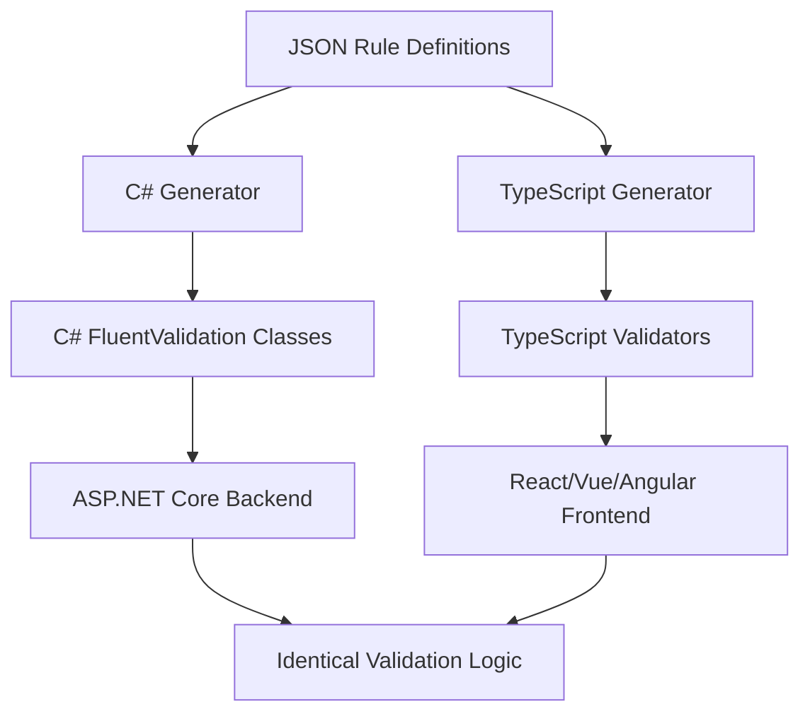
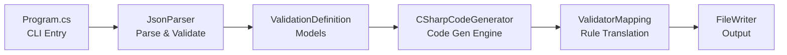
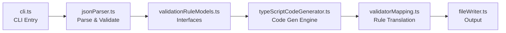
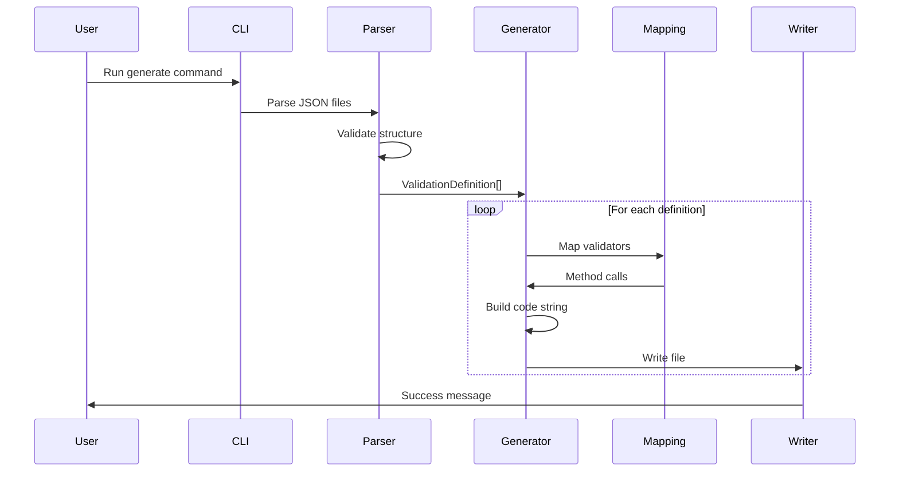
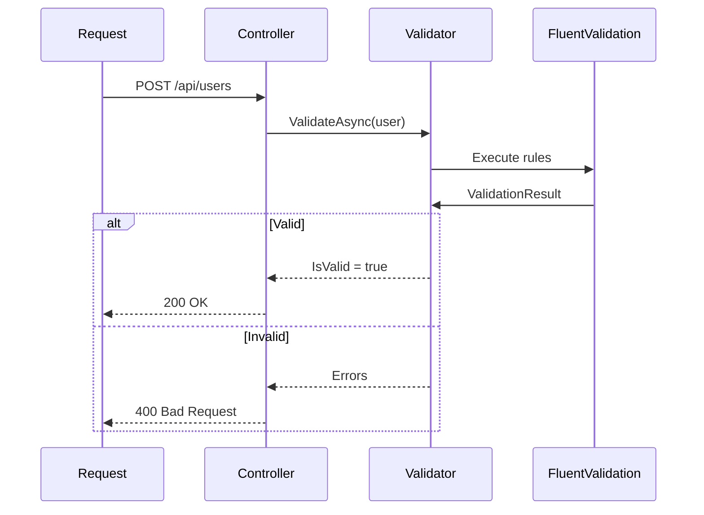
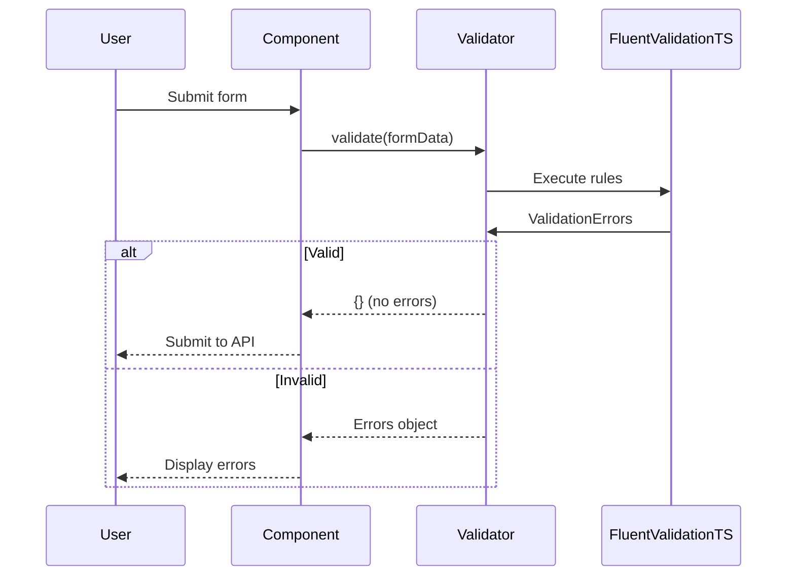

# Architecture Overview

This document provides a high-level overview of the Centralized Validation Rules Engine architecture, design decisions, and extension points.

## System Overview

The Centralized Validation Rules Engine is a code generation system that eliminates duplicate validation logic across frontend and backend applications by:

1. Defining validation rules once in a technology-agnostic JSON format
2. Generating C# FluentValidation classes for backend validation
3. Generating TypeScript fluentvalidation-ts classes for frontend validation



---

## Components

### 1. JSON Schema

**Location:** `schema/validation-schema.json`

**Purpose:** Formal specification of the validation rule format

**Key Design Decisions:**

- Technology-agnostic format (no C# or TypeScript-specific constructs)
- Declarative over imperative
- Human-readable and editable by non-developers
- Extensible for future validator types

**Structure:**

```json
{
  "entity": "EntityName",
  "namespace": "Namespace",
  "properties": [
    {
      "name": "PropertyName",
      "type": "DataType",
      "rules": [
        /* ValidationRule[] */
      ]
    }
  ]
}
```

---

### 2. C# Code Generator

**Location:** `src/csharp-generator/`

**Architecture:**



#### Components

**Program.cs**

- Entry point for CLI application
- Uses System.CommandLine for argument parsing
- Orchestrates the generation process
- Handles errors and user feedback

**JsonParser.cs**

- Reads JSON files from input directory
- Deserializes to strongly-typed models
- Validates structure and required fields
- Provides detailed error messages

**ValidationRuleModels.cs**

- Domain models representing JSON structure
- `ValidationDefinition`: Root entity
- `PropertyValidation`: Property-level rules
- `ValidationRule`: Individual validator

**CSharpCodeGenerator.cs**

- Core code generation engine
- Generates `AbstractValidator<T>` classes
- Creates `RuleFor` chains with proper indentation
- Handles custom messages via `WithMessage`
- Produces properly formatted C# code

**ValidatorMapping.cs**

- Maps JSON validator names to C# FluentValidation methods
- Handles parameter extraction and formatting
- Supports 20+ validators
- Extensible for custom validators

**FileWriter.cs**

- Writes generated code to files
- Creates output directories automatically
- Handles file naming conventions

---

### 3. TypeScript Code Generator

**Location:** `src/typescript-generator/`

**Architecture:**



#### Components

**cli.ts**

- Entry point for CLI application
- Uses commander.js for argument parsing
- Mirrors C# generator UX
- Provides consistent user experience

**jsonParser.ts**

- TypeScript implementation of JSON parsing
- Validates against the same schema
- Type-safe with TypeScript interfaces

**validationRuleModels.ts**

- TypeScript interfaces for JSON structure
- Ensures type safety during code generation

**typeScriptCodeGenerator.ts**

- Core code generation engine
- Generates `Validator<T>` classes
- Creates TypeScript type definitions
- Generates `ruleFor` chains
- Converts PascalCase to camelCase for TypeScript conventions

**validatorMapping.ts**

- Maps JSON validators to fluentvalidation-ts methods
- Handles parameter formatting for TypeScript
- Supports same validators as C# generator

**fileWriter.ts**

- TypeScript implementation of file writing
- Creates directories using Node.js fs API

---

## Design Principles

### 1. Single Source of Truth

All validation rules are defined once in JSON. The generators are **stateless** and always produce identical output from the same input.

### 2. Technology Agnosticism

JSON rules contain no C# or TypeScript-specific code. This allows:

- Future generators for other languages (Java, Python, etc.)
- Changes to implementation libraries without changing rules
- Non-technical stakeholders to review and edit rules

### 3. Separation of Concerns

The system is divided into clear layers:

- **Definition Layer**: JSON rules
- **Generation Layer**: CLI tools
- **Application Layer**: Generated validators
- **Integration Layer**: DI and framework integration

### 4. Extensibility

New validators can be added by:

1. Adding to the JSON schema
2. Implementing mapping in `ValidatorMapping` classes
3. No changes to core generation logic

### 5. Type Safety

Both generators produce strongly-typed code:

- C#: `AbstractValidator<T>` with compile-time checking
- TypeScript: Type definitions and validators

---

## Data Flow

### Generation Process



### Runtime Usage (C#)



### Runtime Usage (TypeScript)



---

## Extension Points

### 1. Adding New Validators

**Step 1: Update JSON Schema**

```json
{
  "validator": "enum": [/* Add "NewValidator" */]
}
```

**Step 2: Implement C# Mapping**

```csharp
// ValidatorMapping.cs
public static string MapToCSharp(string validatorName, ...
{
    return validatorName switch
    {
        // ... existing cases
        "NewValidator" => GenerateNewValidator(parameters),
        _ => throw new NotSupportedException(...)
    };
}

private static string GenerateNewValidator(Dictionary<string, object>? parameters)
{
    var param = GetRequiredParameter(parameters, "someParam", "NewValidator");
    return $"NewValidator({param})";
}
```

**Step 3: Implement TypeScript Mapping**

```typescript
// validatorMapping.ts
static mapToTypeScript(validatorName: string, ...): string {
  switch (validatorName) {
    // ... existing cases
    case 'NewValidator':
      return this.generateNewValidator(parameters);
    default:
      throw new Error(...);
  }
}

private static generateNewValidator(parameters?: Record<string, any>): string {
  const param = this.getRequiredParameter(parameters, 'someParam', 'NewValidator');
  return `newValidator(${param})`;
}
```

### 2. Custom Code Templates

Override code generation by extending `CSharpCodeGenerator`:

```csharp
public class CustomCSharpCodeGenerator : CSharpCodeGenerator
{
    public override string GenerateValidator(ValidationDefinition definition)
    {
        var code = base.GenerateValidator(definition);
        // Add custom attributes, comments, etc.
        return code;
    }
}
```

### 3. Additional Metadata

Extend JSON schema with custom metadata:

```json
{
  "entity": "User",
  "namespace": "MyApp",
  "metadata": {
    "generateTests": true,
    "customAttribute": "[Authorize]"
  },
  "properties": [...]
}
```

Access in generator:

```csharp
if (definition.Metadata?.ContainsKey("generateTests") == true)
{
    // Generate test files
}
```

### 4. Multi-Language Support

Create new generators for other platforms:

1. **Java (Bean Validation)**:

   - `src/java-generator/`
   - Generate `@NotNull`, `@Size`, etc.

2. **Python (Pydantic)**:

   - `src/python-generator/`
   - Generate `Field(..., min_length=...)` validators

3. **Go (validator.v10)**:
   - `src/go-generator/`
   - Generate struct tags: `binding:"required,email"`

---

## Performance Considerations

### Generation Time

- Typical: <1 second for 10-20 entities
- Scales linearly with number of entities
- No network calls or heavy processing

### Generated Code Performance

**C#:**

- FluentValidation is highly optimized
- Compiled validators cached by DI container
- Minimal overhead vs hand-written code

**TypeScript:**

- fluentvalidation-ts uses pure functions
- No reflection or dynamic evaluation
- Tree-shakeable with modern bundlers

---

## Security Considerations

### Input Validation

- JSON parser validates structure before code generation
- Required fields enforced
- Type checking on parameters

### Generated Code

- No code injection possible (templates are static)
- No eval() or dynamic code execution
- All validators use type-safe APIs

### Secrets Management

- No secrets in JSON files
- Validation logic is declarative only
- Database/API calls handled separately

---

## Testing Strategy

### Generator Testing

- Unit tests for JSON parsing
- Unit tests for code generation
- Snapshot tests for output verification
- Integration tests with actual validators

### Generated Validator Testing

- Unit tests for each validator class
- Edge case testing
- Error message verification
- Integration tests with frameworks

---

## Future Enhancements

### Planned Features

1. **Conditional Validation**: `When`/`Unless` clauses
2. **Cross-Property Validation**: Compare two properties
3. **Async Validators**: Database uniqueness checks
4. **i18n Support**: Multi-language error messages
5. **Custom Validators**: User-defined validation logic

### Possible Generators

- Java/Spring Boot
- Python/FastAPI
- Go/Echo or Gin
- PHP/Laravel
- Ruby/Rails

### Tooling

- VS Code extension for JSON editing
- Real-time preview of generated code
- Visual rule builder (web UI)
- Rule testing playground

---

## Contributing

See [CONTRIBUTING.md](CONTRIBUTING.md) for:

- Code style guidelines
- Pull request process
- Testing requirements
- Documentation standards
